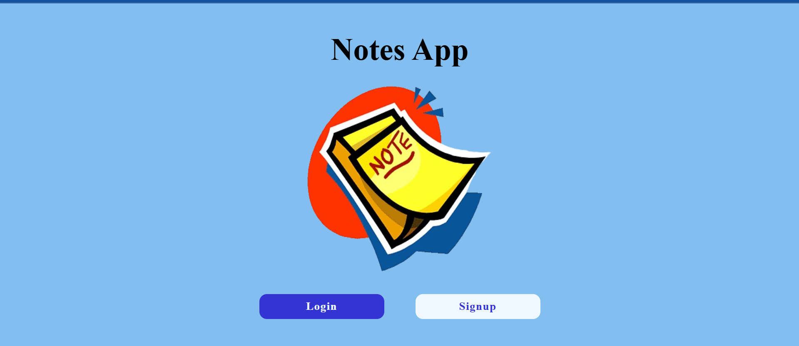
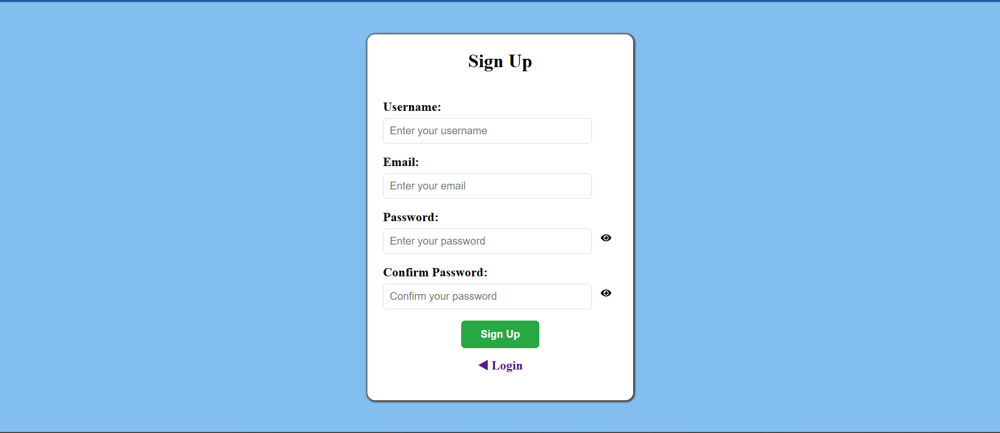
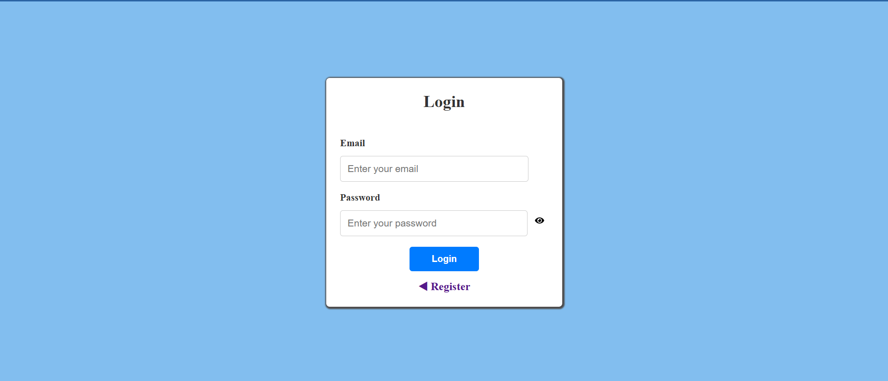
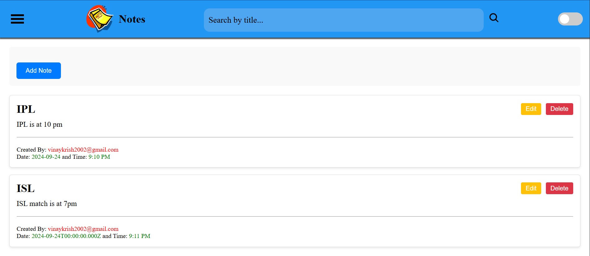
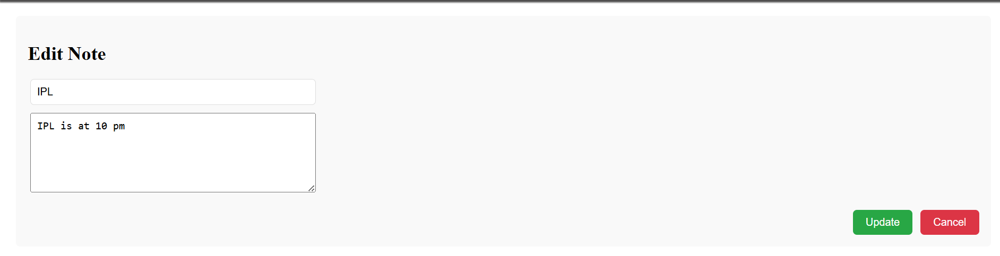
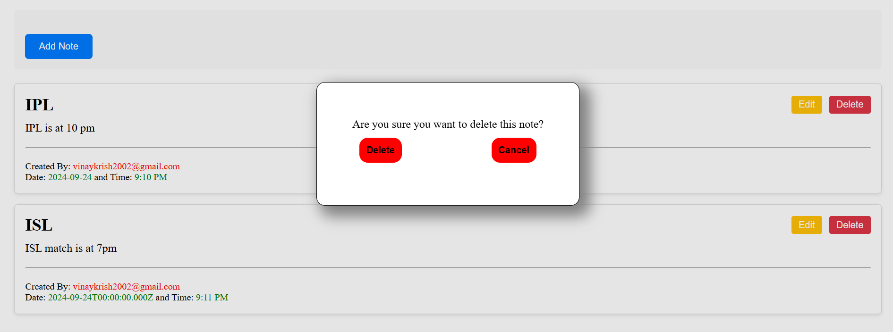
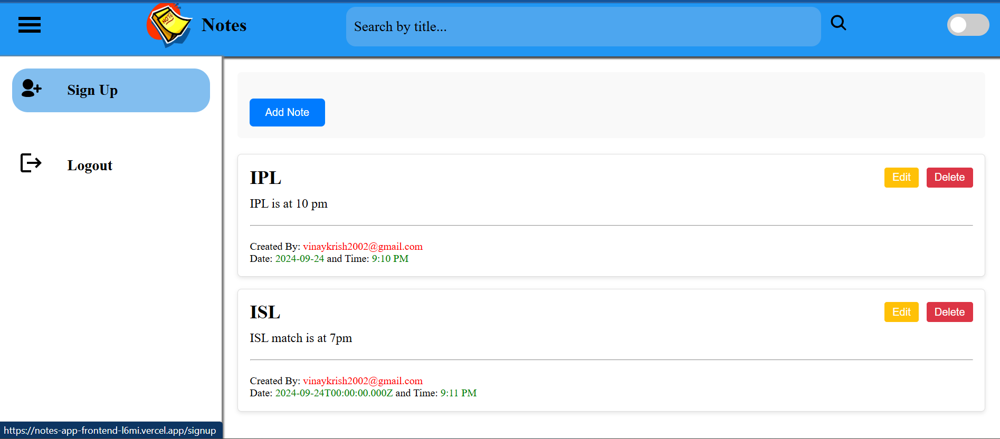

---

# 📝 Notes App – Frontend (React)

This is the **frontend** of a full-stack Notes Application, built using **React.js**. It connects to a backend RESTful API (Node.js + Express + MongoDB) to allow users to manage their personal notes with authentication, dynamic UI updates, and a responsive layout.

---

## 🚀 Features

* 🔐 **Authentication**: Sign Up & Login using JWT-based token stored in cookies.
* ✍️ **Create Notes**: Users can add new notes with a title and content.
* 🛠️ **Edit Notes**: Modify existing notes inline with real-time updates.
* ❌ **Delete Notes**: Remove notes with confirmation modal.
* 🔍 **Search Notes**: Filter notes dynamically by title.
* 🎨 **Responsive UI**: Mobile-friendly layout using CSS.
* 🧠 **Global State Management**: Context API used for global state.
* 🔄 **Auto UI Update**: New and updated notes reflect immediately in the UI without needing a refresh.

---

## 🧾 Folder Structure

```
notes-app-frontend/
├── public/
│   └── index.html
├── src/
│   ├── Assets/               # Images and media
│   ├── Components/
│   │   ├── AddNotes.js       # Add/edit note form
│   │   ├── Notes.js          # Note display and actions
│   │   ├── ConfirmDelete.js  # Confirmation modal
│   │   ├── Login.js          # Login form
│   │   ├── SignUp.js         # Registration form
│   │   ├── Home.js           # Landing page
│   │   ├── Layouts/          # Sidebar, header layout
│   │   ├── ProtectedRoute.js # Auth-protected routing
│   │   └── Api.js            # Axios API instance
│   ├── Context/
│   │   └── AppContext.js     # Global context (or App.js based)
│   ├── Styles/               # CSS files
│   ├── App.js                # Main app wrapper with routes
│   └── index.js              # React DOM render
├── package.json
└── README.md
```

---

## ⚙️ Setup Instructions

### 1. 🔄 Clone the Repository

```bash
git clone https://github.com/yourusername/notes-app-frontend.git
cd notes-app-frontend
```

### 2. 📦 Install Dependencies

```bash
npm install
```

### 3. 🌐 Connect to Backend

Make sure the `baseURL` in `src/Components/Api.js` is correctly pointing to your deployed or local backend:

```js
const Api = axios.create({
  baseURL: "https://your-backend-url.com/",
  withCredentials: true,
  headers: {
    "Content-Type": "application/json",
  },
});
```

> ⚠️ Note: Ensure `withCredentials: true` is enabled both on frontend and backend for cookie-based auth.

### 4. ▶️ Start the Frontend

```bash
npm start
```

This will launch your app at:
📍 `http://localhost:3000`

---

## 🛠️ Environment Setup Notes

* This project assumes you're using a backend deployed on Vercel or similar.
* If using locally: make sure the backend (`PORT=5000`) is running at `http://localhost:5000`.
* Ensure proper CORS settings are enabled on the backend for frontend URL.

---

## ✅ Backend Integration

> The backend must support these routes:

```
POST   /users/register     → Register
POST   /users/login        → Login
GET    /notes              → Get all user notes
POST   /notes              → Create a note
PATCH  /notes/:id          → Update a note
DELETE /notes/:id          → Delete a note
```

---

## 📄 License

This project is licensed under the MIT License.
Feel free to use and modify!

## 🖼️ Snapshots

Here are some UI previews of the Notes App in action:

### 🔐 Authentication Pages

| **Front Page** | **Login Page** | **Register Page** |
|----------------|-------------------|
|  |  |  |

---

### 🏠 Notes Dashboard (After Login)

| **Notes View** | **Edit Mode** | **Delete Confirmation** |
|----------------|---------------|--------------------------|
|  |  |  |

---

### 🧠 Sidebar & Layout

| **Sidebar Menu** |
|------------------|------------------------|
|  |

> 📁 Make sure your images are placed inside a `/screenshots/` folder at the root of your project.

---

### 📝 Tip for GitHub

If you're viewing this README on GitHub, make sure the images are committed to the `/screenshots/` folder so they render correctly online.

---